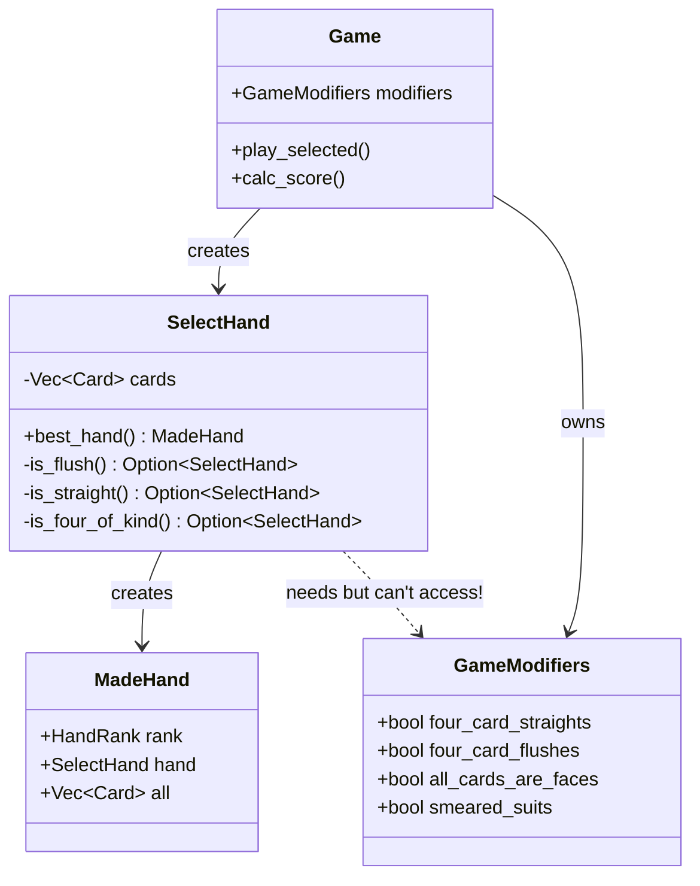
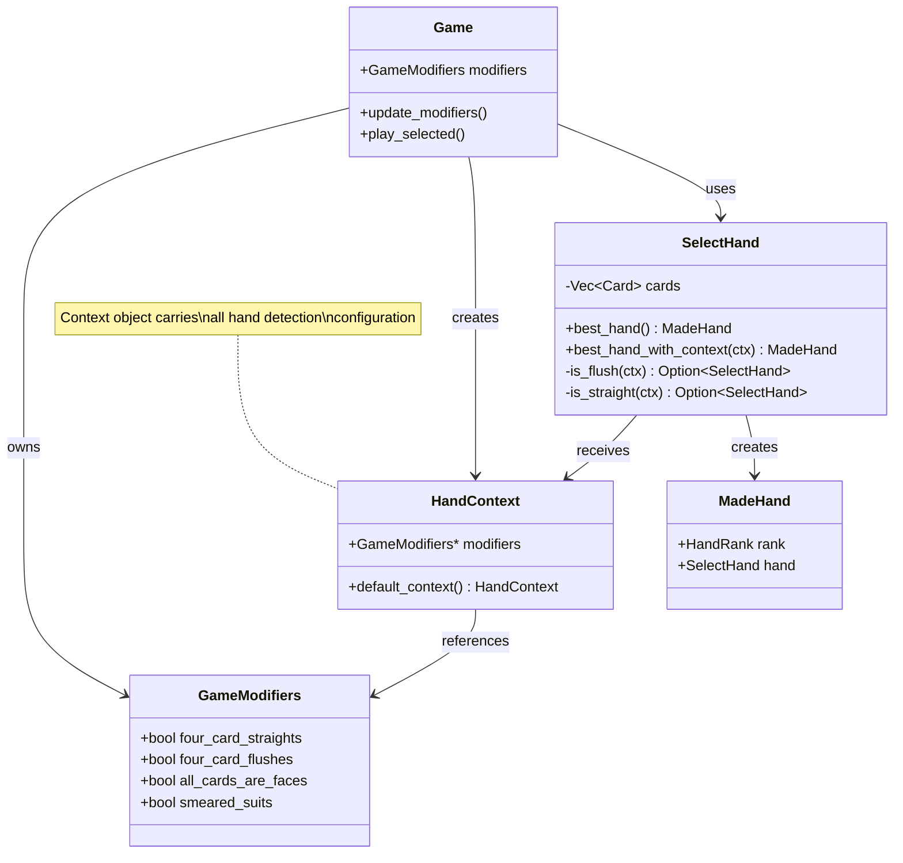

# Hand Detection Refactor Design

## Problem Statement

Currently, hand detection logic in `SelectHand` is self-contained and has no access to game state or modifiers. Phase 3 jokers (Four Fingers, Pareidolia, Smeared Joker, etc.) need to modify hand detection rules, but the architecture doesn't support passing context through.

**Current Flow:**
```
Game::play_selected()
  → SelectHand::best_hand()
    → is_flush(), is_straight(), etc.
      → Returns HandRank
```

**Problem:** `is_flush()` and `is_straight()` can't see `GameModifiers`

## Current Architecture



## Design Options

### Option 1: Pass Modifiers Through Method Calls

**Pros:**
- Explicit dependencies
- No global state
- Easy to test

**Cons:**
- Breaks API for all callers
- Lots of signature changes
- Verbose

```rust
impl SelectHand {
    pub fn best_hand(&self, modifiers: &GameModifiers) -> Result<MadeHand, PlayHandError> {
        // Check all hand types with modifiers
        if let Some(h) = self.is_flush(modifiers) { /* ... */ }
        if let Some(h) = self.is_straight(modifiers) { /* ... */ }
    }

    fn is_flush(&self, modifiers: &GameModifiers) -> Option<SelectHand> {
        let min_cards = if modifiers.four_card_flushes { 4 } else { 5 };
        // detection logic
    }
}

// All call sites need updating:
let best = hand.best_hand(&game.modifiers)?;
```

### Option 2: Context Object Pattern

**Pros:**
- Single parameter to pass
- Extensible for future needs
- Can include other context

**Cons:**
- Slightly more indirection
- Still needs API changes

```rust
pub struct HandContext<'a> {
    pub modifiers: &'a GameModifiers,
    // Future: pub hand_levels: &'a HashMap<HandRank, Level>,
    // Future: pub joker_effects: &'a [JokerEffect],
}

impl SelectHand {
    pub fn best_hand(&self, context: &HandContext) -> Result<MadeHand, PlayHandError> {
        if let Some(h) = self.is_flush(context) { /* ... */ }
        if let Some(h) = self.is_straight(context) { /* ... */ }
    }

    fn is_flush(&self, context: &HandContext) -> Option<SelectHand> {
        let min_cards = if context.modifiers.four_card_flushes { 4 } else { 5 };
        // detection logic with smeared suits
        if context.modifiers.smeared_suits {
            // Hearts/Diamonds count as same, Spades/Clubs count as same
        }
    }
}

// Call site:
let context = HandContext { modifiers: &game.modifiers };
let best = hand.best_hand(&context)?;
```

### Option 3: Builder Pattern with Method Chaining

**Pros:**
- Backward compatible (default context)
- Fluent API
- Optional parameters

**Cons:**
- More complex implementation
- Builder overhead

```rust
impl SelectHand {
    pub fn best_hand(&self) -> HandDetector {
        HandDetector::new(self)
    }
}

pub struct HandDetector<'a> {
    hand: &'a SelectHand,
    modifiers: Option<&'a GameModifiers>,
}

impl<'a> HandDetector<'a> {
    pub fn new(hand: &'a SelectHand) -> Self {
        Self { hand, modifiers: None }
    }

    pub fn with_modifiers(mut self, modifiers: &'a GameModifiers) -> Self {
        self.modifiers = Some(modifiers);
        self
    }

    pub fn detect(self) -> Result<MadeHand, PlayHandError> {
        let mods = self.modifiers.unwrap_or(&GameModifiers::default());
        // hand detection logic
    }
}

// Call sites:
// Old code still works (uses defaults):
let best = hand.best_hand().detect()?;

// New code with modifiers:
let best = hand.best_hand().with_modifiers(&game.modifiers).detect()?;
```

## Recommended Solution: Option 2 (Context Object)

**Rationale:**
1. **Extensible:** HandContext can grow as we add more features
2. **Clean API:** Single parameter makes signatures manageable
3. **Explicit:** Clear what context is needed for hand detection
4. **Future-proof:** Can add hand levels, scoring rules, etc.

### Implementation Plan

#### Phase 1: Create HandContext and Update Signatures (30 min)

```rust
// In hand.rs
pub struct HandContext<'a> {
    pub modifiers: &'a GameModifiers,
}

impl<'a> HandContext<'a> {
    pub fn default_context() -> HandContext<'static> {
        static DEFAULT_MODS: GameModifiers = GameModifiers {
            four_card_straights: false,
            four_card_flushes: false,
            all_cards_are_faces: false,
            smeared_suits: false,
            gap_straights: false,
            all_cards_score: false,
        };
        HandContext { modifiers: &DEFAULT_MODS }
    }
}

impl SelectHand {
    // New API
    pub fn best_hand_with_context(&self, context: &HandContext) -> Result<MadeHand, PlayHandError> {
        // All detection logic
    }

    // Backward compatible wrapper
    pub fn best_hand(&self) -> Result<MadeHand, PlayHandError> {
        self.best_hand_with_context(&HandContext::default_context())
    }
}
```

#### Phase 2: Update Hand Detection Methods (45 min)

```rust
impl SelectHand {
    fn is_flush(&self, context: &HandContext) -> Option<SelectHand> {
        let min_cards = if context.modifiers.four_card_flushes { 4 } else { 5 };

        let suits = self.suits();
        for (suit, cards) in suits.iter() {
            if cards.len() >= min_cards {
                let flush_cards = if context.modifiers.four_card_flushes {
                    // Take best 4 cards
                    cards.iter().sorted_by_key(|c| c.value).rev().take(4).copied().collect()
                } else {
                    cards.clone()
                };
                return Some(SelectHand(flush_cards));
            }
        }

        // Check smeared suits
        if context.modifiers.smeared_suits {
            // Hearts + Diamonds count as same suit
            let red_cards: Vec<Card> = self.0.iter()
                .filter(|c| c.suit == Suit::Heart || c.suit == Suit::Diamond)
                .copied()
                .collect();

            if red_cards.len() >= min_cards {
                let flush_cards = red_cards.into_iter().take(min_cards).collect();
                return Some(SelectHand(flush_cards));
            }

            // Spades + Clubs count as same suit
            let black_cards: Vec<Card> = self.0.iter()
                .filter(|c| c.suit == Suit::Spade || c.suit == Suit::Club)
                .copied()
                .collect();

            if black_cards.len() >= min_cards {
                let flush_cards = black_cards.into_iter().take(min_cards).collect();
                return Some(SelectHand(flush_cards));
            }
        }

        None
    }

    fn is_straight(&self, context: &HandContext) -> Option<SelectHand> {
        let min_cards = if context.modifiers.four_card_straights { 4 } else { 5 };

        // Existing straight detection logic, but look for min_cards instead of 5
        let values = self.values_unique();

        // Check for consecutive sequences of length >= min_cards
        for window_size in (min_cards..=5).rev() {
            for window in values.windows(window_size) {
                if is_consecutive(window) {
                    let straight_cards: Vec<Card> = window.iter()
                        .filter_map(|v| self.0.iter().find(|c| c.value == *v))
                        .copied()
                        .collect();
                    return Some(SelectHand(straight_cards));
                }
            }
        }

        // Handle Ace-low straights
        // ...

        None
    }
}
```

#### Phase 3: Update Game Call Sites (30 min)

```rust
// In game.rs
impl Game {
    pub(crate) fn play_selected(&mut self) -> Result<(), GameError> {
        // ... existing code ...

        let selected = SelectHand::new(self.available.selected());

        // Create context with modifiers
        let context = HandContext { modifiers: &self.modifiers };
        let best = selected.best_hand_with_context(&context)?;

        // ... rest of logic ...
    }

    pub(crate) fn calc_score(&mut self, hand: MadeHand) -> usize {
        // Scoring already has access to self.modifiers
        // Can check modifiers.all_cards_score here
    }
}
```

#### Phase 4: Update Tests (15 min)

```rust
#[test]
fn test_four_fingers_flush() {
    let mut g = Game::default();

    // Create 4 hearts
    let h2 = Card::new(Value::Two, Suit::Heart);
    let h3 = Card::new(Value::Three, Suit::Heart);
    let h5 = Card::new(Value::Five, Suit::Heart);
    let h7 = Card::new(Value::Seven, Suit::Heart);
    let c9 = Card::new(Value::Nine, Suit::Club);

    let hand = SelectHand::new(vec![h2, h3, h5, h7, c9]);

    // Without modifiers - should be High Card
    let best = hand.best_hand().unwrap();
    assert_eq!(best.rank, HandRank::HighCard);

    // Add Four Fingers and update modifiers
    g.jokers.push(Jokers::FourFingers(FourFingers {}));
    g.update_modifiers();

    // With modifiers - should be Flush
    let context = HandContext { modifiers: &g.modifiers };
    let best = hand.best_hand_with_context(&context).unwrap();
    assert_eq!(best.rank, HandRank::Flush);
}
```

## New Architecture Diagram



## Migration Strategy

### Backward Compatibility

Old code continues to work:
```rust
// Still works - uses default context
let best = hand.best_hand()?;
```

New code uses context:
```rust
// New code - explicit context
let context = HandContext { modifiers: &game.modifiers };
let best = hand.best_hand_with_context(&context)?;
```

### Gradual Migration

1. **Week 1:** Add HandContext, keep both APIs
2. **Week 2:** Update Game to use new API
3. **Week 3:** Update tests to use new API
4. **Week 4:** Deprecate old API (optional)

## Testing Strategy

### Unit Tests for Hand Detection

```rust
#[test]
fn test_flush_detection_normal() {
    let hand = SelectHand::new(vec![
        Card::new(Value::Two, Suit::Heart),
        Card::new(Value::Four, Suit::Heart),
        Card::new(Value::Six, Suit::Heart),
        Card::new(Value::Eight, Suit::Heart),
        Card::new(Value::Ten, Suit::Heart),
    ]);

    let ctx = HandContext::default_context();
    let best = hand.best_hand_with_context(&ctx).unwrap();
    assert_eq!(best.rank, HandRank::Flush);
}

#[test]
fn test_flush_detection_four_card() {
    let hand = SelectHand::new(vec![
        Card::new(Value::Two, Suit::Heart),
        Card::new(Value::Four, Suit::Heart),
        Card::new(Value::Six, Suit::Heart),
        Card::new(Value::Eight, Suit::Heart),
        Card::new(Value::Ten, Suit::Club), // Different suit
    ]);

    // Without modifier - not a flush
    let ctx = HandContext::default_context();
    let best = hand.best_hand_with_context(&ctx).unwrap();
    assert_ne!(best.rank, HandRank::Flush);

    // With modifier - is a flush
    let mods = GameModifiers {
        four_card_flushes: true,
        ..Default::default()
    };
    let ctx = HandContext { modifiers: &mods };
    let best = hand.best_hand_with_context(&ctx).unwrap();
    assert_eq!(best.rank, HandRank::Flush);
}

#[test]
fn test_smeared_suits() {
    let hand = SelectHand::new(vec![
        Card::new(Value::Two, Suit::Heart),
        Card::new(Value::Four, Suit::Diamond),
        Card::new(Value::Six, Suit::Heart),
        Card::new(Value::Eight, Suit::Diamond),
        Card::new(Value::Ten, Suit::Heart),
    ]);

    // Hearts + Diamonds should count as flush with smeared_suits
    let mods = GameModifiers {
        smeared_suits: true,
        ..Default::default()
    };
    let ctx = HandContext { modifiers: &mods };
    let best = hand.best_hand_with_context(&ctx).unwrap();
    assert_eq!(best.rank, HandRank::Flush);
}
```

### Integration Tests

```rust
#[test]
fn test_four_fingers_integration() {
    let mut game = Game::default();
    game.stage = Stage::Blind(Blind::Small, None);

    // Buy Four Fingers
    game.money += 1000;
    game.stage = Stage::Shop();
    let joker = Jokers::FourFingers(FourFingers {});
    game.shop.jokers.push(joker.clone());
    game.buy_joker(joker).unwrap();
    game.update_modifiers();

    // Verify modifiers are set
    assert!(game.modifiers.four_card_flushes);
    assert!(game.modifiers.four_card_straights);

    // Play a 4-card flush
    game.stage = Stage::Blind(Blind::Small, None);
    // ... play hand and verify it's detected as flush
}
```

## File Structure

```
core/src/
├── hand.rs                 # HandContext, SelectHand, MadeHand
├── game.rs                 # Game, GameModifiers
├── joker.rs                # Joker implementations
└── tests/
    ├── hand_detection.rs   # Unit tests for hand detection
    └── joker_modifiers.rs  # Integration tests for modifier jokers
```

## Implementation Checklist

- [ ] Add HandContext struct to hand.rs
- [ ] Add best_hand_with_context() method
- [ ] Keep best_hand() as backward-compatible wrapper
- [ ] Update is_flush() to accept context and check modifiers
- [ ] Update is_straight() to accept context and check modifiers
- [ ] Add smeared_suits logic to is_flush()
- [ ] Update Game::play_selected() to use new API
- [ ] Update Game::calc_score() to check all_cards_score modifier
- [ ] Write unit tests for each modifier
- [ ] Write integration tests for joker behavior
- [ ] Update existing tests to use new API where needed
- [ ] Call update_modifiers() when jokers are added/removed

## Future Enhancements

HandContext can be extended for:
- Hand levels for scoring calculations
- Retrigger counts
- Card-specific modifications
- Temporary effects

```rust
pub struct HandContext<'a> {
    pub modifiers: &'a GameModifiers,
    pub hand_levels: Option<&'a HashMap<HandRank, Level>>,
    pub retrigger_count: usize,
    // Future additions...
}
```

## Estimated Timeline

- **Context Setup:** 30 minutes
- **Hand Detection Changes:** 1 hour
- **Game Integration:** 30 minutes
- **Testing:** 45 minutes
- **Bug Fixes:** 30 minutes

**Total: ~3 hours**

## Risk Mitigation

1. **Backward Compatibility:** Keep old API working
2. **Incremental Testing:** Test each change individually
3. **Rollback Plan:** Git commits at each phase
4. **Documentation:** Update comments as we go
